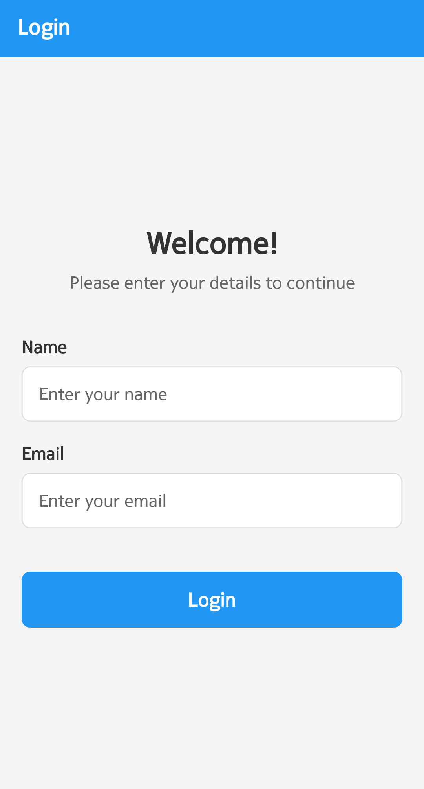
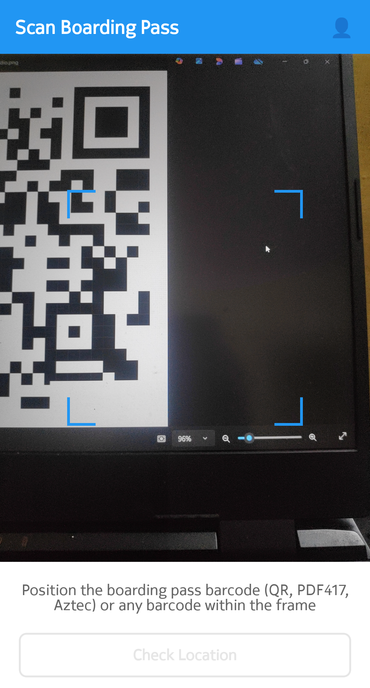
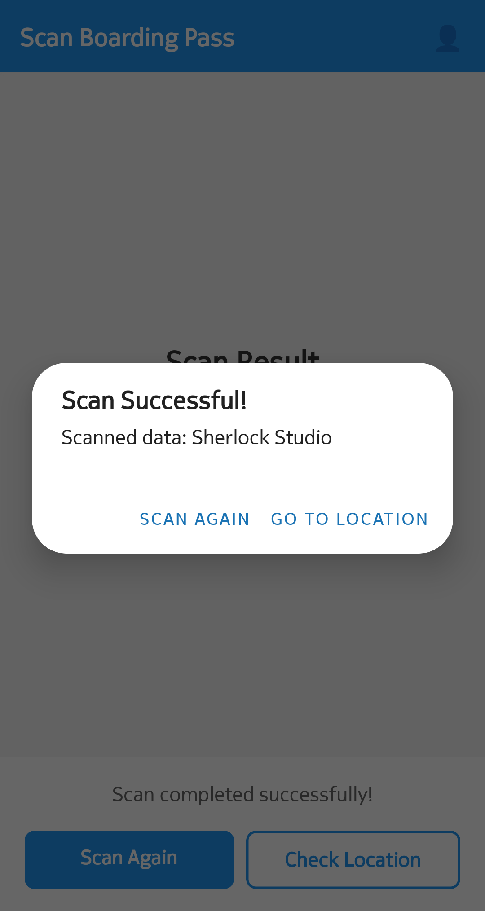
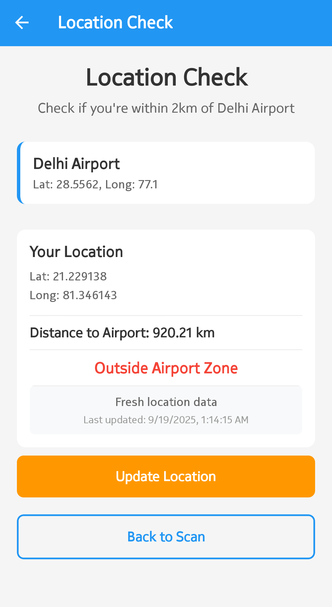

# CheckIn360 - Boarding Pass Scanner & Location Tracker










# Overview
A comprehensive React Native application demonstrating advanced mobile development skills including UI design, barcode scanning, location services, and state management. Built with Expo and modern React Native best practices.

## Technology Stack

- **Framework**: React Native with Expo SDK 54
- **Navigation**: React Navigation Stack
- **State Management**: React Hooks with AsyncStorage
- **Camera**: Expo Camera with barcode scanning
- **Location**: Expo Location with geofencing
- **Storage**: AsyncStorage for local data persistence
- **UI**: Custom components with responsive design

## Quick Start

### Prerequisites
- **Node.js** (v14 or higher)
- **Expo CLI**: `npm install -g @expo/cli`
- **Android Studio** (for Android development)
- **Xcode** (for iOS development, macOS only)

### Installation & Setup
```bash
# Clone and navigate to project
cd CheckIn360

# Install dependencies
npm install

# Start Expo development server
npm start
```

### Running the Application
```bash
# Android (recommended for testing)
npm run android
# Alternative: Press 'a' in the terminal

# iOS (macOS only)
npm run ios  
# Alternative: Press 'i' in the terminal

# Web (limited functionality)
npm run web
```

### Permission Management
- **Android**: Settings → Apps → CheckIn360 → Permissions
- **iOS**: Settings → Privacy → Camera/Location → CheckIn360

## Architecture & Code Quality

### Project Structure
```
src/
├── screens/           # Screen components
│   ├── LoginScreen.js
│   ├── ScanScreen.js
│   ├── LocationScreen.js
│   ├── ProfileScreen.js
│   └── SplashScreen.js
├── utils/            # Utility functions
│   └── helpers.js
├── constants/        # App constants
│   ├── colors.js
│   └── dimensions.js
└── components/       # Reusable components
```

## Production Build

### Android APK
```bash
# Install EAS CLI
npm install -g @expo/eas-cli

# Login to Expo
eas login

# Configure build
eas build:configure

# Build APK
eas build --platform android --profile preview
```

### iOS Build
```bash
# Build for iOS (requires macOS)
eas build --platform ios --profile preview
```

---

**Note**: This app requires camera and location permissions to function properly. Grant these permissions when prompted for the best experience.